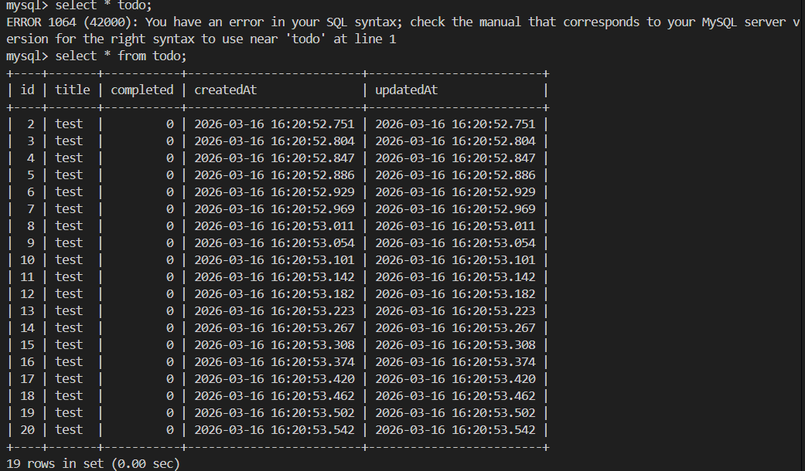

# Pembatasan Tingkat (Rate Limiting)

Pembatasan tingkat diimplementasikan menggunakan `express-rate-limit` untuk melindungi API dari penyalahgunaan dan lonjakan traffic brute-force.

## Cara Kerja

Ada dua lapisan pembatasan tingkat:

1. **Pembatasan tingkat global** (berlaku untuk semua request)
2. **Pembatasan tingkat spesifik route** (batas lebih ketat pada endpoint mutasi seperti POST/PUT/DELETE)

### Pembatasan tingkat global

Dikonfigurasi di `src/security/rateLimiter.js` sebagai `apiRateLimiter`, dan diterapkan pada app Express di `src/app.js`.

Menggunakan variabel lingkungan (dengan default):

- `RATE_LIMIT_WINDOW_MS` (default `900000` = 15 menit)
- `RATE_LIMIT_MAX` (default `100`)

Ketika batas terlampaui, API mengembalikan HTTP **429 Too Many Requests**.

### Pembatasan tingkat spesifik route

Route `todos` dilindungi dengan pembatasan tingkat yang lebih ketat:

- Membuat todos (`POST /todos`) dibatasi via:
  - `RATE_LIMIT_CREATE_TODO_WINDOW_MS`
  - `RATE_LIMIT_CREATE_TODO_MAX`

- Memutasi todos (`PUT /todos/:id`, `DELETE /todos/:id`) dibatasi via:
  - `RATE_LIMIT_MUTATION_WINDOW_MS`
  - `RATE_LIMIT_MUTATION_MAX`

Ini dikonfigurasi di `src/routes/todos.js` menggunakan `createRouteRateLimiterFromEnv`.

## Bukti Kerja (rate limiting dalam aksi)

Ketika batas tercapai, server merespons dengan **429 Too Many Requests**. Anda dapat mengamati perilaku ini dengan menjalankan loop request cepat:

```bash
for i in {1..30}; do
  curl -s -o /dev/null -w "%{http_code}\n" -X POST http://localhost:3000/todos \
    -H "Content-Type: application/json" \
    -d '{"title":"test"}'
done
```

Setelah maksimal yang dikonfigurasi tercapai, output akan berisi entri `429`.

### Bukti Demo

Untuk menyimpan bukti, proyek dapat menyimpan screenshot yang menunjukkan respons `429` dan hasil insert database.
Letakkan di `docs/img/Database.png` dan referensikan di bawah:



> Screenshot harus menunjukkan bahwa setelah N insert berhasil, request selanjutnya mengembalikan 429.
